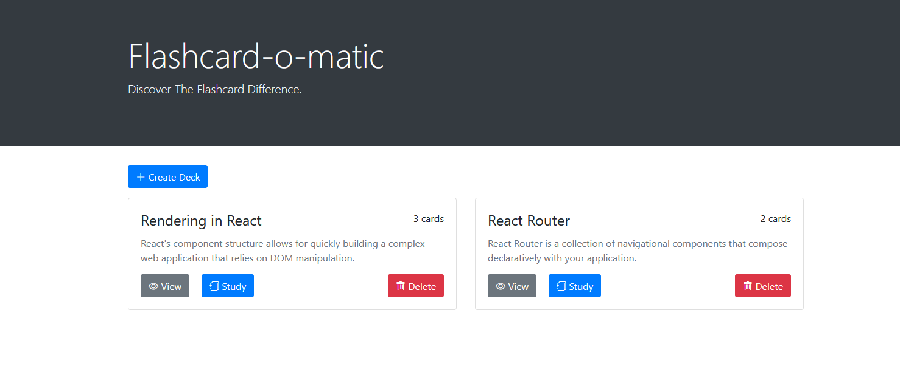
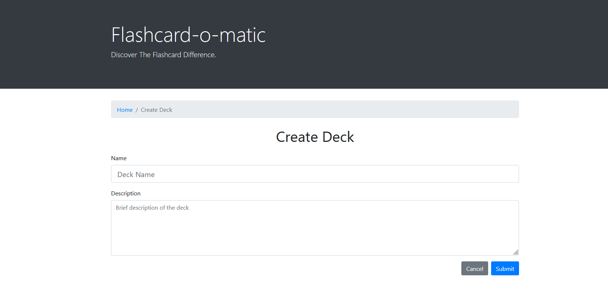
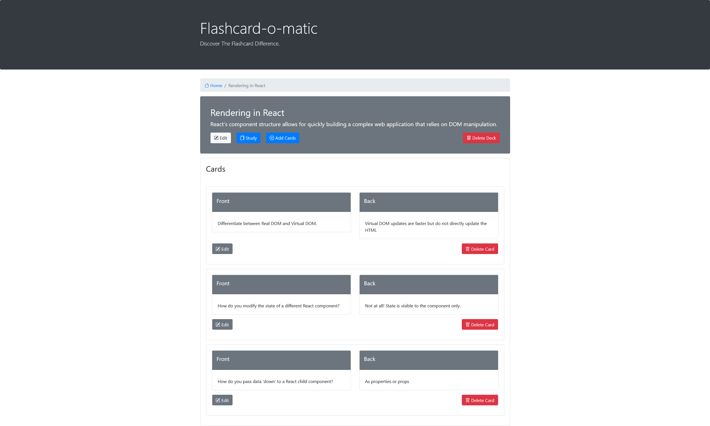

# Flashcard-O-Matic 

This project was bootstrapped with [Create React App](https://github.com/facebook/create-react-app).

## Project description: Flashcard-o-matic

A local school has decided to put together a flash card application, Flashcard-o-matic, to help their students study online. Teachers will use this application to create decks of flash cards for the subjects that they teach, and students will study the decks. The school needs you to build the application that the students and teachers will use.

### Demo

Open [demo](https://flashcard-o-matic-f9511jgn9-xjinojose.vercel.app/) to view it in your browser.

### Express API

Open [flashcard-o-matic API](https://json-server-vercel-alpha-six.vercel.app/) to view it in your browser.

Note:
To run it locally, change the value of API_BASE_URL in utils/api/index.js to http://localhost:5000 (see below)

const API_BASE_URL = process.env.API_BASE_URL || "https://json-server-vercel-alpha-six.vercel.app";

## Getting Started

### `Home`

- **Create Deck**: prompts the user to enter the deck name and description.
- **Decks**: display the decks.
- **View**: shows the deck information and the cards in that deck.
- **Study**: direct the users to an study session using the deck's flashcards.
- **Delete**: deletes the deck.

### `Create Deck`

### `View Deck`

**Deck**
- **Edit**: prompts the user to change the deck name and/or description.
- **Study**: direct the users to an study session using the deck's flashcards.
- **Add Cards**: add a card to the deck.
- **Delete**: deletes the entire deck.

**Cards**
- **Edit**: Edit the card's front and/or back.
- **Delete**: Deletes the card.

### `npm run eject`

**Note: this is a one-way operation. Once you `eject`, you can't go back!**

If you aren't satisfied with the build tool and configuration choices, you can `eject` at any time. This command will remove the single build dependency from your project.

Instead, it will copy all the configuration files and the transitive dependencies (webpack, Babel, ESLint, etc) right into your project so you have full control over them. All of the commands except `eject` will still work, but they will point to the copied scripts so you can tweak them. At this point you're on your own.

You don't have to ever use `eject`. The curated feature set is suitable for small and middle deployments, and you shouldn't feel obligated to use this feature. However we understand that this tool wouldn't be useful if you couldn't customize it when you are ready for it.

## Learn More

You can learn more in the [Create React App documentation](https://facebook.github.io/create-react-app/docs/getting-started).

To learn React, check out the [React documentation](https://reactjs.org/).

### Code Splitting

This section has moved here: [https://facebook.github.io/create-react-app/docs/code-splitting](https://facebook.github.io/create-react-app/docs/code-splitting)

### Analyzing the Bundle Size

This section has moved here: [https://facebook.github.io/create-react-app/docs/analyzing-the-bundle-size](https://facebook.github.io/create-react-app/docs/analyzing-the-bundle-size)

### Making a Progressive Web App

This section has moved here: [https://facebook.github.io/create-react-app/docs/making-a-progressive-web-app](https://facebook.github.io/create-react-app/docs/making-a-progressive-web-app)

### Advanced Configuration

This section has moved here: [https://facebook.github.io/create-react-app/docs/advanced-configuration](https://facebook.github.io/create-react-app/docs/advanced-configuration)

### Deployment

This section has moved here: [https://facebook.github.io/create-react-app/docs/deployment](https://facebook.github.io/create-react-app/docs/deployment)

### `npm run build` fails to minify

This section has moved here: [https://facebook.github.io/create-react-app/docs/troubleshooting#npm-run-build-fails-to-minify](https://facebook.github.io/create-react-app/docs/troubleshooting#npm-run-build-fails-to-minify)
